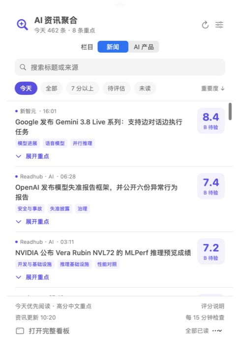

# AI Product Frontier Resource Aggregator

**AI 产品的前沿资源整合器** · [English](README.md) · [下载 Mac 版](https://github.com/owenmao-builder/ai-product-frontier-resource-aggregator/releases/latest)

基于**实质增量、实际影响、解释价值、决策价值**四项标准，筛选市面上较为重要的 AI 技术与产品信息，通过 **Mac 状态栏**查看核心信息、中文重点和证据依据。

基于 [SuYxh/ai-news-aggregator](https://github.com/SuYxh/ai-news-aggregator) 扩展，提供原生 SwiftUI 菜单栏与完整 React 看板。

## 界面预览

以上为 2026 年 9 月 17 日的界面样例，发布条目随时间窗口变化。

## 核心功能

- **菜单栏直接看：** 单个 ✦ 图标，展开新闻、刷新、查看中文重点，点标题阅读原文。
- **直接给关注分：** 按模型升级、架构变更、产品热度和关注匹配立即评分，无需 API Key 或先完成证据核验。
- **证据讲清楚：** A 充分、B 待验、C 不足。数字表示阅读关注度，字母表示依据是否充分；C 也能有关注分。
- **高分中文重点：** 7 分及以上展示发生了什么、相比之前有什么变化、影响与限制。
- **近一周大厂上新：** 展示具体型号、版本、新功能及官方发布日期；超过最近 7 个自然日（含今天）自动移出，不用品牌名充当新产品。
- **近期热门工具：** 显示 GitHub 周榜新增星数、HN 近 7 天讨论及来源。热度不等于质量。
- **完整看板：** 搜索、来源和类型筛选、收藏、阅读历史、暗色主题。
- **直接订阅：** 包含「苔藓之火」的 Substack 公开文章与播客文字稿。

## 安装

在 [Releases](https://github.com/owenmao-builder/ai-product-frontier-resource-aggregator/releases/latest) 下载 `AI-News-macOS-arm64.zip`，解压后将 `AI News.app` 放到 Applications 并打开，点击状态栏的 **✦**。

支持 **Apple Silicon / macOS 13+**。下载包使用本地签名，尚未经过 Apple 公证；也可以按 [英文说明](README.md#build-and-develop) 从源码构建。

## 更新与评估

默认按**关注分**降序排序。模型升级、架构变更的基础权重各 30，产品热度 25、关注匹配 15；只计适用维度，按实际权重归一到 0–10 分。纯产品消息使用“产品/技术进展”维度；模型发布不必同时改变架构。缺少热度时按 2.5/5 中性估值，并在分项说明里标出。普通品牌提及、传闻和旧模型接入不算新模型升级。

已有信息足够立即估关注分，不等待正文、官方引文、竞品对照或 A/B 证据。证据状态单独保留。7 分以上可展开重点；只读到标题时明确标为“标题要点”，高分公开英文标题每轮最多翻译今天 5 条。关注产品名单可在设置中编辑，历史评估材料保留。详细公式及例子见 [当前评分标准](macos/SCORE_POLICY.md)。

默认每 15 分钟在本机运行完整采集器，直接检查已配置的资讯平台（含 AIbase、Info Flow、新智元、TechURLs、Buzzing、NewsNow 等）以及公开 RSS 目录。官方博客和苔藓之火同时独立刷新，不再依赖第三方聚合 JSON 的生成时间。应用内置经过 SHA-256 校验的 Node.js 运行时，下载用户无需另装 Node。

每个采集入口有本轮检查时间、成功/失败、最近成功时间与最近发布时间。HTTP 错误、不可解析页面和超时会显示为异常；单个来源失败保留缓存，其余来源继续更新。成功表示取得该来源返回的内容，不保证来源自身持续发布或及时更新。入口数与资讯中的作者/来源数是不同统计口径。

关闭看板后继续运行，退出应用后停止；不自动注册开机启动。刷新会保留已有条目的 ID、评分、翻译和阅读记录。新内容去重合并后进入菜单栏与完整看板，只更新当天的关注分，历史分数不重新计算；只用当天小组样例检查规则效果。

新闻时间统一显示北京时间（UTC+8）。当天的新智元条目会批量核对原站接口，优先显示并缓存原站发布时间，刷新后不会被上游错误时间覆盖。仅在没有可靠发布时间时显示“收录”，悬停可查看原因；两种时间都无效时显示未知。同分时，发布时间明确的条目排在仅有收录时间的条目前。原始时间字段保留。

AIbase 使用发布者结构化数据中的 `addtime`，不使用页面修改时间或“刚刚”。本地化与旧版文章链接合并时保留原 ID；日期路径明显过期的档案文章不会因重新抓到而进入最新列表。

每轮新闻采集同时识别具体模型、架构、产品和功能发布，读取支持的官方来源或追溯报道中的原始链接，核对首发日后自动同步到 Mac 菜单栏和产品看板。最近 7 天统一按北京时间自然日计算；缺少官方资料、日期不明确或来源读取失败的，显示为可展开的“待核验发布线索”，注明原因和链接。已有核实条目在来源失败时保留，到期自动移出；抓取日、文章修改日和再次报道日不能代替首发日。

自动发现无需模型 API Key，目前覆盖千问、智谱、OpenAI、Anthropic、Google、DeepSeek、Meta、Mistral、NVIDIA 的可识别具体发布，不能保证全网完整。内置编辑资料补充已人工核对的官方公告与说明，包括限制自动读取的官网。产品同步不会改动已有新闻评分，核对发布事实也不代表独立验证性能宣称。

GitHub 周趋势榜本周新增至少 500 星，或相关 HN 话题近 7 天至少 100 赞，才计为近期热门；热度数据超过 24 小时停止计入。

本机直接计算关注分，无需模型 API。可选的正文分析可在设置中配置兼容 Chat Completions 的 HTTPS API、模型和 Key，每轮最多补充今天 5 条高分消息的原文分析与中文重点；失败不影响关注分。启用后公开正文及对照片段会发送给所配模型，可能产生费用，Key 保存在 macOS 钥匙串。

GitHub 的采集工作流默认手动运行；仓库发布后不会自动部署网站。详细规则见 [评分标准](macos/SCORE_POLICY.md)，数据与原项目说明见 [UPSTREAM.md](UPSTREAM.md)。

## 开源与致谢

采用 [MIT License](LICENSE)。感谢 [SuYxh/ai-news-aggregator](https://github.com/SuYxh/ai-news-aggregator) 提供采集器和 React 看板基础。原项目署名及扩展范围见 [NOTICE](NOTICE)。新闻原文及第三方材料的权利归相应权利人所有。
